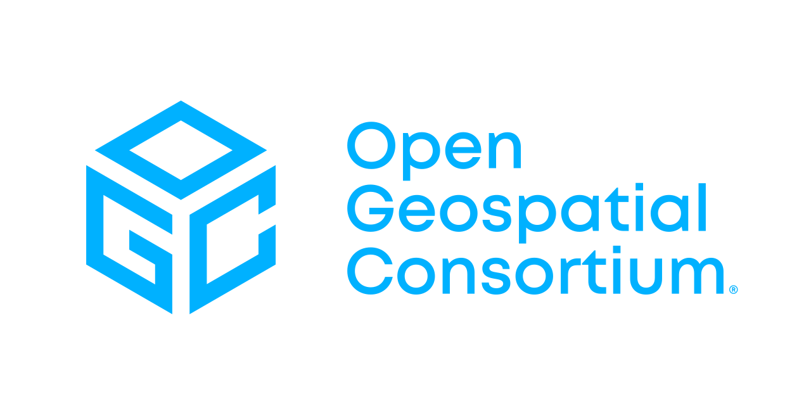
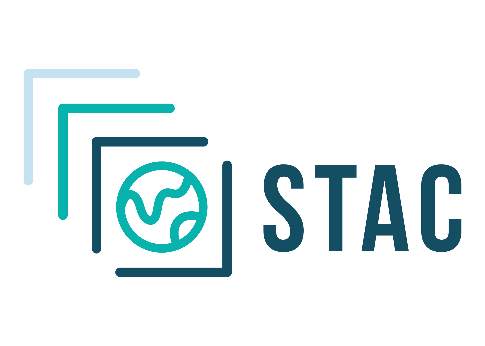

# Introduction

<table style="border-collapse: collapse; background: transparent; border !important: none; width: 100%;">
	<tr style="background: transparent; border: none;">
		<td style="border: none; background: transparent; text-align: center; padding: 0.25rem;">
			
		</td>
		<td style="border: none; background: transparent; text-align: center; padding: 0.25rem;">
			
		</td>
		<td style="border: none; background: transparent; text-align: center; padding: 0.25rem;">
			
		</td>
		<td style="border: none; background: transparent; text-align: center; padding: 0.25rem;">
			
		</td>
	</tr>
</table>

This guide aims to compile best practices and expectations for the design and development phase of a data processing chain, ensuring its optimal use for deployment in a data production center or similar facility. The ecosystem surrounding information technologies used for Earth observation is becoming increasingly standardized through consortia like the OGC and standards like STAC, supported by the ESA. There are also dynamics surrounding Cloud Compliant standards, such as those developed by the CNG. Adhering to these standards enhances the visibility of the chains that reference them and thus provides significant support for the dissemination of the algorithms used.

However make a choice of the standards to be followed, and do not try to follow all of them at once is not easy. This guide is intended to help developers navigate this landscape and make informed decisions about the design and development of their data processing chains, ensuring that they meet the necessary standards for deployment and maintenance base on different levels of best practices.

---

## Levels of Best Practices

In order to facilitate the understanding and implementation of best practices, they are categorized into three levels: Mandatory, Recommanded, and Best Pratices. Each level corresponds to a set of requirements and recommendations that guide the design and development of data processing chains.

The purpose of these levels is to provide a clear framework for developers, helping them prioritize their efforts and ensure that their processing chains meet the necessary standards for deployment and maintenance.

| Level      | Animal Icon | Comment                                              |
| :--------- | :---------- | :--------------------------------------------------- |
| **Mandatory**   | Fox 🦊      | Mandatory requirements for any new processing chain. |
| **Recommended** | Wolf 🐺     | Strongly recommended and soon to be mandatory.       |
| **Best practices** | Lion 🦁     | Suggested best practices.                            |
